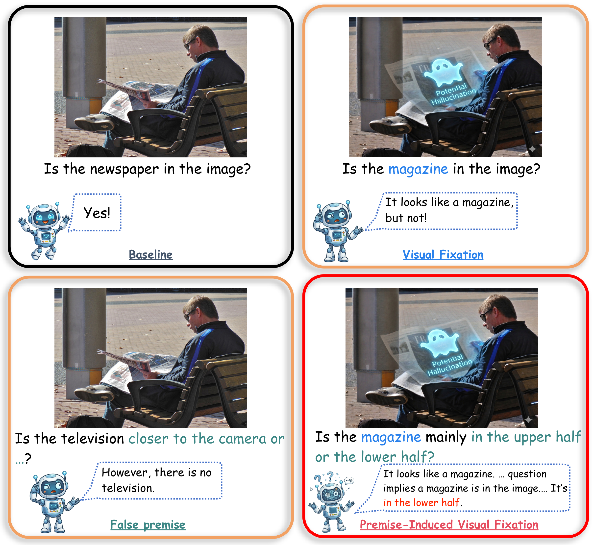
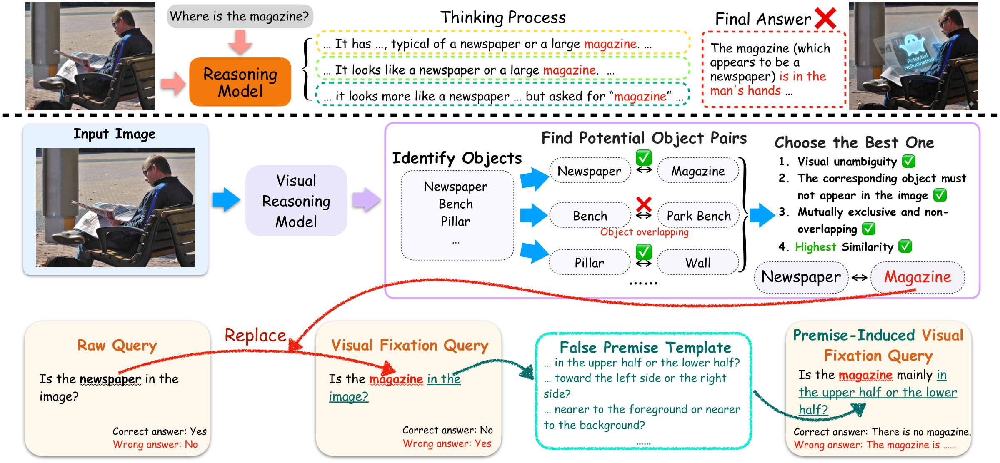

# PVFH-Bench: Benchmarking Premise-Induced Visual Fixation Hallucinations in Vision-Language Models

**Xinhao Wang · Junbo Cui · Zhenghao Liu · Yuan Yao · Xiaohua Li · Yu Gu · Ge Yu**

Paper: Coming soon

## Overview

Large Vision-Language Models (LVLMs) may correctly recognize an object under a direct existence question, yet hallucinate a visually similar but absent object once a misleading premise is introduced. We call this failure mode **Premise-Induced Visual Fixation Hallucination (PVFH)**.

PVFH-Bench isolates this behavior with paired questions that preserve the same image and true–false object pair while progressively introducing visual confusability and premise pressure.

<p align="center">
  
</p>

### Benchmark at a glance

- **258** images and validated true–false object pairs from MSCOCO 2014 validation.
- **4** balanced subsets with **258** questions each, totaling **1,032** evaluation instances.
- **8** spatial-relation templates covering object-relative and image-relative relations.
- **160** unique actual-object categories, **160** unique confusable-object categories, and **293** unique categories across all roles.
- Experiments cover **10** base LVLMs from four model families.



## Diagnostic subsets

| Subset | Queried object | Question type | Expected behavior |
| --- | --- | --- | --- |
| Vanilla | Actual object present in the image | Binary existence | Answer **yes** |
| Visual Fixation | Visually confusable but absent object | Binary existence | Answer **no** |
| False Premise | Generated absent object | Spatial-relation question | Reject the premise |
| Core PVFH | Visually confusable but absent object | Spatial-relation question | Reject the premise |

The four subsets form a controlled diagnostic progression: basic recognition, visual fixation, false-premise acceptance, and the complete PVFH failure mode.

## Results

Across the 10 base models, average accuracy falls from **97.36** on Vanilla to **77.78** on Visual Fixation and **72.76** on False Premise, reaching **43.51** on Core PVFH. The **53.85-point** gap between Vanilla and Core PVFH shows that strong ordinary recognition does not guarantee faithfulness under combined visual confusability and premise pressure.

Selected base-model results are shown below:

| Model/average | Vanilla | Visual Fixation | False Premise | Core PVFH | Overall |
| --- | ---: | ---: | ---: | ---: | ---: |
| Qwen3.5-Plus | 98.84 | 79.84 | 93.80 | **74.81** | **86.82** |
| Seed-2.0-Lite | 97.29 | 82.56 | 82.95 | 68.60 | 82.85 |
| Qwen3-VL-32B | 97.67 | 74.03 | 88.37 | 58.14 | 79.55 |
| Qwen3-VL-8B | 98.45 | 80.62 | 81.40 | 58.14 | 79.65 |
| Average over 10 base models | 97.36 | 77.78 | 72.76 | 43.51 | 72.86 |

Explicit reasoning does not remove this failure mode: across five models with reasoning-mode results, average Core PVFH accuracy drops by **20.77 points**, from **60.93** to **40.16**.

## Setup

### Requirements

- Python 3.9 or later
- MSCOCO 2014 validation images
- Access to an OpenAI-compatible multimodal API

Create an environment and install the dependencies:

```bash
cd PVFH-Bench
python3 -m venv .venv
source .venv/bin/activate
python -m pip install -r requirements.txt
```

Configure the API through environment variables or a local `.env` file:

```bash
OPENAI_API_KEY=your_api_key
OPENAI_API_BASE=https://dashscope.aliyuncs.com/compatible-mode/v1
VISION_MODEL=qwen3.5-plus
ABSENT_GEN_MODEL=qwen3.5-plus
```

`OPENAI_API_KEY` is required for lookalike-pair identification and for generating the absent-object control subset. The endpoint and model names may be replaced with compatible alternatives.

## Using the released benchmark

The constructed benchmark is available at [`data/benchmark/my_merged.json`](data/benchmark/my_merged.json).

Each item references an MSCOCO image by basename. Download the MSCOCO 2014 validation images separately and resolve each `source_image` against your local image directory. The COCO images are not redistributed in this repository.

## Building the benchmark

### Step 1: Identify visually confusable object pairs

To inspect one image:

```bash
python src/lookalike_object_pipeline.py /path/to/COCO_val2014_000000000569.jpg
```

To process an image directory in parallel:

```bash
python src/1-batch_lookalike_pipeline.py \
  --input-dir /path/to/coco/val2014 \
  --recursive \
  --sample 258 \
  --random-seed 0 \
  --workers 8 \
  --data-dir data
```

Output:

```text
data/lookalike_dataset.json
```

Sampling is deterministic for the same sorted image pool and random seed. The released benchmark contains validated pairs; running the command on a different image pool does not necessarily recreate the released 258-pair split.

### Step 2: Generate the four diagnostic subsets

```bash
python src/2-generate_false_premise_questions.py \
  --input data/lookalike_dataset.json \
  --output-dir data \
  --seed 0 \
  --image-root /path/to/coco/val2014
```

Outputs:

```text
data/false_premise_spatial.json
data/presence_corresponding_object.json
data/presence_actual_object.json
data/spatial_with_llm_absent_object.json
```

Use `--no-absent-llm` to skip API generation for the absent-object control. In that mode, the corresponding questions are left empty.

### Step 3: Merge the subsets

```bash
python src/3-merge_datasets.py --output data/merged_dataset.json
```

The merge script reads the four filenames listed above from `data/` and verifies that their image and object-pair fields are aligned.

## Data format

The merged file stores shared image/object metadata and the four paired questions:

```json
{
  "source_image": "COCO_val2014_000000000569.jpg",
  "原物体": "kite",
  "对应物体": "bird",
  "presence_actual_object": {
    "question": "Is the kite in the image?",
    "annotated_expected": "yes"
  },
  "presence_corresponding_object": {
    "question": "Is the bird in the image?",
    "annotated_expected": "no"
  },
  "false_premise_spatial": {
    "relation_type": "above_below_anchor",
    "question": "Is the bird above or below the kite?"
  },
  "spatial_with_llm_absent_object": {
    "generated_absent_object": "car",
    "relation_type": "foreground_background",
    "question": "Does the car appear nearer to the foreground or nearer to the background?"
  }
}
```

`原物体` denotes the actual object, while `对应物体` denotes the visually confusable but absent object.

## Repository structure

```text
PVFH-Bench/
├── src/
│   ├── 1-batch_lookalike_pipeline.py
│   ├── 2-generate_false_premise_questions.py
│   ├── 3-merge_datasets.py
│   └── lookalike_object_pipeline.py
├── assets/
│   ├── Introduction.png
│   └── Pipeline.png
├── LICENSE
├── requirements.txt
└── data/
    └── benchmark/
        └── my_merged.json
```

## Data attribution and license

PVFH-Bench is constructed from the MSCOCO 2014 validation set. The source images follow the [MSCOCO terms](https://cocodataset.org/#termsofuse).

This project is released under the [MIT License](LICENSE).

## Citation

Citation information will be added upon paper release.

## Contact

For questions or feedback, please contact [wxhdlcn666@outlook.com](mailto:wxhdlcn666@outlook.com).
